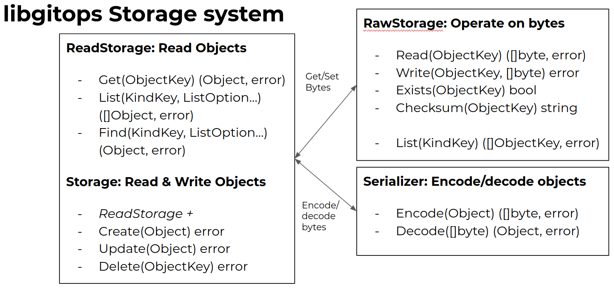
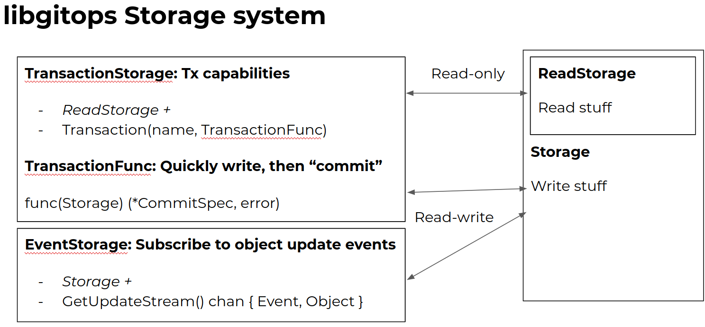

# Weave libgitops

A library of tools for manipulation and storage of K8s-style objects with inbuilt GitOps functionality.
Weave `libgitops` builds on top of the [Kubernetes API Machinery](https://github.com/kubernetes/apimachinery).

The library consists of several components, including (but not limited to):

### The Serializer - `pkg/serializer`

The libgitops `Serializer` is a powerful extension of the API Machinery serialization/manifest manipulation tools.
It operates on K8s `runtime.Object` compliant objects (types that implement `metav1.TypeMeta`), and focuses on
streamlining the user experience of dealing with encoding/decoding, versioning (GVKs), conversions and defaulting.

**Feature highlight:**
- Preserving of Comments (even through conversions)
- Strict Decoding
- Multi-Frame Support (multiple documents in one file)
- Works with all Kube-like objects

**Example usage:**

```go
// Create a serializer instance for Kubernetes types
s := serializer.NewSerializer(scheme.Scheme, nil)

// Read all YAML documents, frame by frame, from STDIN
fr := serializer.NewYAMLFrameReader(os.Stdin)

// Decode all YAML documents from the FrameReader to objects
objs, err := s.Decoder().DecodeAll(fr)

// Write YAML documents, frame by frame, to STDOUT
fw := serializer.NewYAMLFrameWriter(os.Stdout)

// Encode all objects as YAML documents, into the FrameWriter
err = s.Encoder().Encode(fw, objs...)
```

See the [`pkg/serializer`](pkg/serializer) package for details.

**Note:** If you need to manipulate unstructured objects (not struct-backed, not `runtime.Object` compliant), the
[kyaml](https://pkg.go.dev/sigs.k8s.io/kustomize/kyaml@v0.6.0/yaml?tab=doc) library from kustomize may be a better fit.

### The extended `runtime` - `pkg/runtime`

The [`pkg/runtime`](pkg/runtime) package provides additional definitions and helpers around the upstream API Machinery
runtime. The most notable definition is the extended `runtime.Object` (from herein `pkg/runtime.Object`):

```go
// Object is an union of the Object interfaces that are accessible for a
// type that embeds both metav1.TypeMeta and metav1.ObjectMeta.
type Object interface {
	runtime.Object
	metav1.ObjectMetaAccessor
	metav1.Object
}
```

This extended `runtime.Object` is used heavily in the storage subsystem described below.

### The storage system - `pkg/storage`

The storage system is a collection of interfaces and reference implementations for storing K8s-like objects (that comply
to the extended `pkg/runtime.Object` described above). It can be though of as a database abstraction layer for objects
based on how the interfaces are laid out.

There are three "layers" of storages:
1. `RawStorage` implementations deal with _bytes_, this includes `RawStorage` and `MappedRawStorage`.
2. `Storage` implementations deal with _objects_, this includes `Storage`, `WatchStorage`, `TransactionStorage` and
    `EventStorage`.
3. "Abstract" storage implementations bind together multiple `Storage` implementations, this includes `GitStorage`,
   `ManifestStorage` (and `SyncStorage`, which is currently unused).

**Example on how the storages interact:**





See the [`pkg/storage`](pkg/storage) package for details.

### The filtering framework - `pkg/filter`

The filtering framework provides interfaces for `pkg/runtime.Object` filters and provides some basic filter
implementations. These are used in conjunction with storages when running `Storage.Get` and `Storage.List` calls.

There are two interfaces:
- `ListFilter` describes a filter implementation that filters out objects from a given list.
- `ObjectFilter` describes a filter implementation returning a boolean for if a single given object is a match.

There is an `ObjectToListFilter` helper provided for easily creating `ListFilter`s.

See the [`pkg/filter`](pkg/filter) package for details.

### The GitDirectory - `pkg/gitdir`

The `GitDirectory` is an abstraction layer for a temporary Git clone. It pulls and checks out new changes periodically
in the background. It allows high-level access to write operations like creating a new branch, committing, and pushing.

It is currently utilizing some functionality from [go-git-providers](https://github.com/fluxcd/go-git-providers/), but
should be refactored to utilize it more thoroughly. See
[weaveworks/libgitops#38](https://github.com/weaveworks/libgitops/issues/38) for more details regarding the integration.

See the [`pkg/gitdir`](pkg/gitdir) package for details.

### Utilities - `pkg/util`

This package contains utilities used by the rest of the library. The most interesting thing here is the `Patcher`
under [`pkg/util/patch`](pkg/util/patch), which can be used to apply patches to `pkg/runtime.Object` compliant types.

## Getting Help

If you have any questions about, feedback for or problems with `libgitops`:

- Invite yourself to the [Weave Users Slack](https://slack.weave.works/).
- Ask a question on the [#general](https://weave-community.slack.com/messages/general/) Slack channel.
- [File an issue](https://github.com/weaveworks/libgitops/issues/new).

Your feedback is always welcome!

## Maintainers

- Chanwit Kaewkasi, [@chanwit](https://github.com/chanwit)

## Notes
This project was formerly called `gitops-toolkit`, but has now been given a more descriptive name.
If you've ended up here, you might be looking for the real [GitOps Toolkit](https://github.com/fluxcd/toolkit).